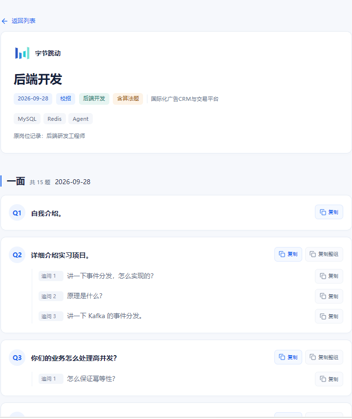

<div align="center">


# 面个 Offer

**把真实问题，留给下一次面试。**

把散落在各处的面经整理起来，方便搜索、阅读和复习。

**[在线体验 →](https://soarhill.github.io/interview-vault/)** · [本地运行](#本地运行)

[](LICENSE)

</div>

## 产品预览

**首页 · 查找公司与岗位面经**


**详情 · 面试问题与追问**



<details>
<summary>查看关于页</summary>


</details>

## 为什么做面个 Offer

最开始只是想给自己做个顺手的小工具。

准备秋招时，发现面经大多散落在牛客等平台，想找某家公司、某个岗位的面试题，总得翻来翻去，手机上看也不太方便。

平时遇到不会的题，我还喜欢复制给 AI 继续学习，但从长帖子里找问题、复制粘贴，实在有点折腾。

所以就有了面个 Offer。把面经按公司、岗位和面试轮次整理好，想查就查，遇到不会的题也能一键复制给 AI。

原本只是想方便自己，后来觉得或许也能帮到其他正在准备面试的人，就索性把它开源分享出来。

## 能做什么

- **找面经**：按公司、岗位和招聘类型筛选，搜索想了解的面试问题。
- **读面经**：按轮次查看问题与追问，一键复制到笔记或常用的 AI 中继续学习。
- **分享面经**：完整版支持 GitHub 登录、投稿草稿、人工审核与发布后的内容修改。

> 在线体验提供浏览与检索；投稿、审核等功能已在完整版中实现，可在本地运行。

## 技术架构

完整版采用 Next.js + Spring Boot + PostgreSQL，前后端通过 REST API 通信。

| 部分 | 技术 |
| --- | --- |
| 前端 | Next.js 16 · React 19 · TypeScript · Tailwind CSS 4 |
| 后端 | Java 25 · Spring Boot 3.5 · Spring Security · MyBatis-Plus |
| 数据库 | PostgreSQL 18 · Flyway · Spring Session JDBC |

除搜索与面经管理外，后端还实现了 GitHub OAuth、投稿审核、候选目录治理和版本冲突处理。具体设计见 [系统架构](docs/architecture/system-architecture.md)。

## 本地运行

需要 **JDK 25、Maven 3.9+、Node.js 20.9+ 和 Docker**。

```bash
git clone https://github.com/soarhill/interview-vault.git
cd interview-vault
```

**1. 启动 PostgreSQL 和后端**（Bash / Git Bash）

```bash
docker run -d --name interview-vault-pg \
  -e POSTGRES_PASSWORD=dev \
  -e POSTGRES_DB=interviewvault \
  -p 127.0.0.1:5433:5432 \
  postgres:18
cd backend
mvn spring-boot:run
```

**2. 另开终端，启动前端**

```bash
cd frontend
npm ci
```

在 `frontend/.env.local` 中填写：

```dotenv
NEXT_PUBLIC_API_MOCK=false
NEXT_PUBLIC_API_BASE_URL=http://localhost:8080
```

```bash
npm run dev
```

打开 [http://localhost:3000](http://localhost:3000)。数据库由 Flyway 自动初始化；真实 GitHub 登录需另行配置 OAuth。

更多配置与测试方法见 [后端说明](backend/README.md)、[前端说明](frontend/README.md)和[部署指南](docs/deployment/production-deployment.md)。

## 项目文档

[产品需求](docs/product/prd.md) · [系统架构](docs/architecture/system-architecture.md) · [API 设计](docs/api/api-design.md) · [数据库设计](docs/database/database-design.md)

## 参与贡献

欢迎通过 [Issue](https://github.com/soarhill/interview-vault/issues) 反馈建议，或参照 [贡献指南](CONTRIBUTING.md) 提交 PR。安全问题请通过 [私密报告渠道](SECURITY.md) 反馈。

## 开源协议

项目自有源码采用 [Apache License 2.0](LICENSE)。面经内容及第三方商标的权利归各自权利人；注明来源不代表取得转载授权。

## 最后

AI 时代真的很奇妙。

很多以前只会停留在脑海里的小念头，如今也能慢慢变成真正能用的东西。

面个 Offer 也是这样。最初只是想给自己做个方便查面经的小工具，没想到折腾着折腾着，就有了现在的样子。

**我一直觉得，分享面经本身就是一件挺浪漫的事。** 如果自己留下的经验，能帮助另一个人拿到心仪的 Offer，想想就觉得很开心。

或许我们素不相识，但在某个平行时空里，一份小小的分享，恰好帮到了另一个正在努力的人。

我想，这就是这个网站存在的意义。

**最后，愿每一份认真准备都有回响，愿看到这里的你，收到那封期待已久的 Offer。**
