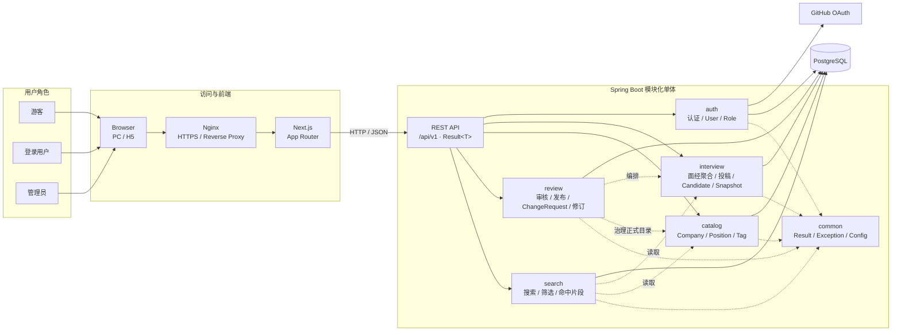
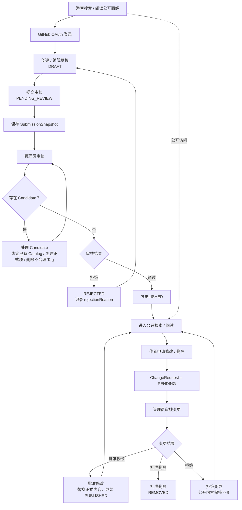
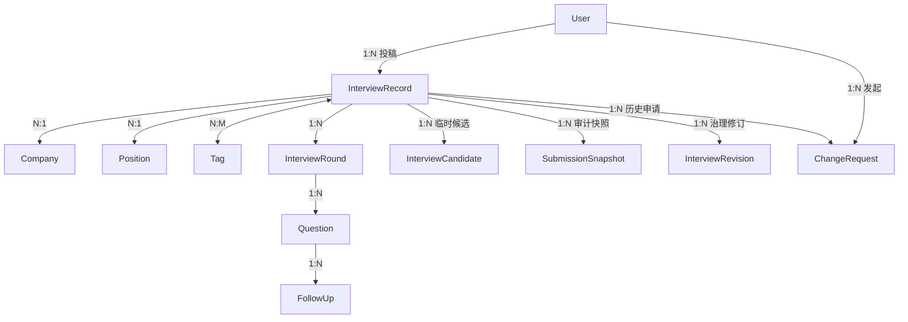
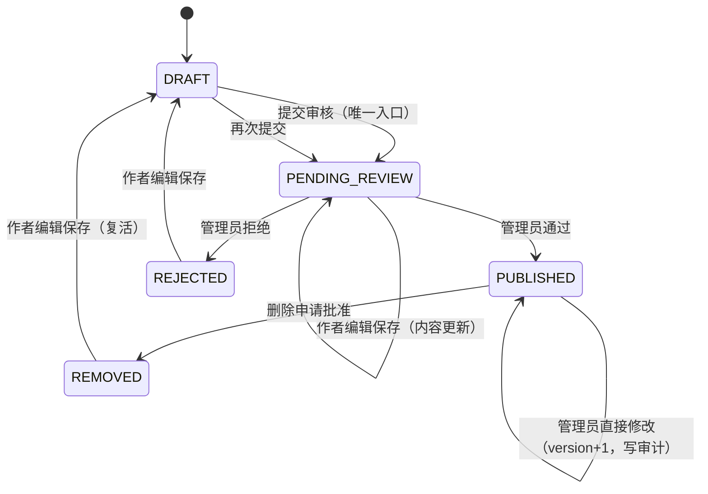
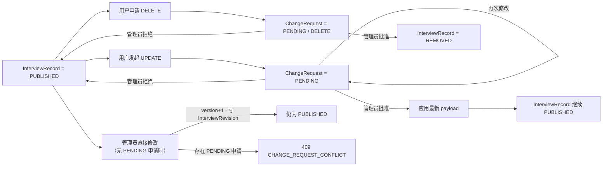

# 面个 Offer（Interview Vault）系统架构

> **版本：V1 · Public Beta**
>
> **更新时间：2026-10-07**
>
> 产品规则见 [PRD](../product/prd.md)，物理表结构与数据库约束见 [数据库设计](../database/database-design.md)，API 契约见 [API 设计](../api/api-design.md)。

---

## 1. 架构目标

V1 的核心不是堆功能，而是稳定支撑五条业务链路：

1. 搜索
2. 阅读
3. 投稿
4. 审核
5. 内容治理

架构设计遵循以下原则：

- 先做模块化单体，不提前拆微服务。
- PostgreSQL 作为唯一核心数据源。
- 游客可直接搜索和阅读，贡献能力才需要登录。
- GitHub OAuth 只负责身份认证，不建设邮箱密码体系。
- 用户提交结构化数据，不建设线上 Markdown Parser。
- 正式公司、岗位、标签与“用户候选值”隔离，避免 UGC 污染正式分类数据。
- 已发布内容与待审核修改隔离，审核期间线上旧版本继续可用。

---

## 2. 技术栈

- 前端：Next.js + TypeScript
- 后端：Java + Spring Boot
- 数据库：PostgreSQL
- 接口：REST API + OpenAPI
- 登录：GitHub OAuth
- 部署：单机 Docker + Nginx 反向代理 + HTTPS（仓库不含部署文件，要求见部署 Runbook）

前端不直连数据库，所有业务读写通过 Spring Boot API 完成。

V1 不引入 Redis、消息队列、Elasticsearch、独立搜索服务或微服务。真实数据量和查询计划证明 PostgreSQL 不够用之后，再做针对性演进。

---

## 3. 系统总览

### 3.1 总体架构图

下面这张图描述 V1 的**角色、访问层、前端、后端业务模块、外部认证与数据库**之间的关系。



架构含义：

- Next.js 负责页面与交互，不直连数据库。
- Spring Boot 是一个单 Maven Module 的模块化单体，顶层按 `auth / interview / catalog / review / search / common` 组织。
- `interview` 拥有面经主体；`catalog` 拥有平台正式目录；`review` 负责审核与内容治理；`search` 只负责查询能力。
- `common` 是横切技术能力，不拥有业务实体。
- PostgreSQL 是 V1 唯一核心数据源。
- GitHub 只承担 OAuth 身份认证。

### 3.2 核心业务闭环

下面这张图描述 V1 从“公开浏览”到“投稿、审核、发布、后续变更治理”的完整闭环。



这张图只表达业务闭环。具体状态转换、version 乐观锁、Candidate 约束和 ChangeRequest 规则，分别在后续章节、数据库设计和 API 设计中定义。

---

## 4. 逻辑模块

这里描述的是**业务边界**，不要求机械地“一模块 = 一个 Maven Module”。V1 继续采用模块化单体，根据代码规模按业务分包即可。

| 模块 | 核心职责 |
| --- | --- |
| auth | GitHub OAuth、本站用户创建/识别、USER / ADMIN 权限、会话与 CSRF |
| interview | 面经创建、草稿编辑、提交审核、公开详情、轮次/问题/追问聚合、候选值（InterviewCandidate）、提交快照（SubmissionSnapshot）、“我的投稿” |
| search | 关键词检索、公司/岗位/招聘类型筛选、命中片段、问题定位、联动计数 |
| catalog | Company / Position / Tag 正式目录数据的读取与管理员维护 |
| review | 投稿审核、发布/拒绝、已发布内容直接治理（管理员修改 + InterviewRevision 审计）、ChangeRequest 审批 |
| common | 全局 Result、异常处理、全局配置等跨模块技术能力；不承载业务实体 |

common 是顶层技术公共包，不是业务领域；它只承载 Result、全局异常、全局配置等跨模块技术能力。具体分包规则见 [包结构规范](../backend/package-structure.md)。

模块归属的一条关键裁决：**InterviewCandidate 与 SubmissionSnapshot 归 interview 拥有，review 只读取与处理**。它们由“用户投稿 / 提交审核”动作创建，属于 InterviewRecord 聚合的一部分；如果放 review，会导致 interview 的投稿用例反向依赖 review，与依赖方向图矛盾。review 真正拥有的是 ChangeRequest、InterviewRevision 与审核用例本身。

---

## 5. 领域模型

### 5.1 核心聚合

`InterviewRecord` 是 V1 最核心的聚合根。

一份面经内部的：

- InterviewRound
- Question
- FollowUp

没有脱离面经独立存在的业务生命周期，因此由 `InterviewRecord` 统一管理。

而：

- Company
- Position
- Tag
- User

属于可以被多份面经复用的独立实体，不跟随某一份面经一起创建或删除。



---

### 5.2 InterviewRecord

核心业务字段：

```text
InterviewRecord
- id
- authorId
- companyId
- positionId
- department
- originalPositionName
- inferredPositionName
- note
- recruitType
- status
- version
- rejectionReason
- createTime
- updateTime
- publishTime
```

关联数据：

```text
- tags
- rounds
- candidates
- snapshots
- revisions
- changeRequests
- sources
```

说明：

- `authorId`：用户投稿时指向 GitHub 登录用户；存量数据可以为空。
- `companyId / positionId`：待审核阶段可能暂时为空，因为用户可能提出了新的候选公司或岗位。
- `department`：部门，长期产品字段；新投稿可选填写（如“抖音电商”）。
- `originalPositionName / inferredPositionName / note`：真实性辅助字段，保留原岗位原文、有依据的推断岗位与有事实含义的限定说明；新投稿 UI 不主动填写，但公开详情存在这些字段时以辅助信息展示。
- `recruitType`：V1 仅支持实习、校招。
- `status`：表达面经生命周期，不叠加 `isPublished / deleted` 等互相冲突的布尔状态。
- `version`：乐观锁版本号；作者编辑、管理员审核、发布等会改变审核内容的成功写操作递增，用于防止旧页面静默覆盖新版本。
- `rejectionReason`：当前一次审核被拒绝时给投稿人的可读原因；作者编辑保存被拒投稿（回到 DRAFT）时清空，新的拒绝结果覆盖。
- 卡片展示的“面试时间”不单独冗余到 InterviewRecord，而是从轮次日期中取最早已确认日期。

---

### 5.3 InterviewRound

```text
InterviewRound
- id
- interviewId
- roundType
- roundNo
- remark
- interviewDate
- interviewDatePrecision
- sortOrder
- createTime
- updateTime
```

`interviewDatePrecision` 与日期同空同有：

```text
DAY / MONTH / YEAR
```

V1 简化冻结后，新投稿没有精度概念：日期是完整 YYYY-MM-DD（DAY）或为空。MONTH / YEAR 只服务存量数据真实性（只确认到月 / 年的面试时间按已知部分保存，展示为「2026年6月」「2026年」；更新时日期未变则精度原样保留）。真实面试日无法确认的轮次，日期必须为空，说明写入 InterviewRecord.note——发布时间不冒充面试时间。

新投稿的标准轮次：

```text
TECHNICAL + 1 -> 一面
TECHNICAL + 2 -> 二面
TECHNICAL + 3 -> 三面
TECHNICAL + 4 -> 四面
TECHNICAL + 5 -> 五面
HR              -> HR 面
```

特殊说明通过 `remark` 保留，例如：

```text
TECHNICAL + 3 + remark="交叉面"
=> 三面 · 交叉面
```

无法安全归一的轮次不强行猜测：以 UNKNOWN 类型 + remark 保留原始轮次说明；线上新投稿 UI 只暴露标准技术面与 HR 面。

`sortOrder` 决定实际展示顺序，不能依赖数据库 ID 或创建时间排序。

---

### 5.4 Question / FollowUp

```text
Question
- id
- roundId
- content
- sortOrder

FollowUp
- id
- questionId
- content
- sortOrder
```

规则：

- 一轮包含 1～N 个主问题。
- 一个主问题包含 0～N 个追问。
- 追问依附于主问题，不占独立 Q 编号。
- Q1 / Q2 / Q3 是展示层根据 `sortOrder` 生成，不作为业务 ID。
- 问题锚点使用稳定 Question ID，不能依赖 Q 编号。
- 算法题的题名、LeetCode 链接等扩展字段由数据库模型保留，但不改变 Question 的核心生命周期。

---

### 5.5 Company / Position / Tag

```text
Company
- id
- name
- normalizedName
- createTime
- updateTime

Position
- id
- name
- normalizedName
- category
- createTime
- updateTime

Tag
- id
- name
- normalizedName
- createTime
- updateTime
```

`Position.name` 表示具体岗位，例如：

- Java 后端开发
- Go 后端开发
- Agent Infra Engineer

岗位方向是管理员可扩展目录（存于 `position_category` 表），初始五类：
`Agent 开发 / AI 应用 / AI Infra / 后端开发 / 其他`。`Position.categoryId` 关联
目录行；历史代码枚举 `PositionCategory` 仅作兼容保留，不再冻结值域。

`normalizedName` 用于唯一性判断，例如 `Redis / redis / REDIS` 应视为同一正式标签。

---

### 5.6 User

```text
User
- id
- githubId
- githubLogin
- avatarUrl
- role
- createTime
- updateTime
```

`githubId` 是本站识别 GitHub 用户的稳定外部身份，必须唯一。

`githubLogin` 只用于展示，因为 GitHub 用户名可以修改，不能拿它作为本站唯一身份。

V1 角色只保留：

```text
USER
ADMIN
```

V1 不长期保存 GitHub Access Token，除非未来出现“代表用户调用 GitHub API”的明确需求。

---

### 5.7 InterviewCandidate

正式 Company / Position / Tag 只保存平台已经确认的数据。

用户投稿时遇到不存在的值，不直接污染正式字典，而是保存为候选值：

```text
InterviewCandidate
- id
- interviewId
- type
- value
- normalizedValue
- sortOrder
- createTime
```

`type`：

```text
COMPANY
POSITION
TAG
```

示例：

```text
正式 companyId = null
候选 COMPANY = "OpenAI"

正式 tags = [Redis]
候选 TAG = "Agent Memory"
```

管理员可以：

1. 关联到已有正式项；
2. 修改名称后创建正式项；
3. 创建新的正式项；
4. 删除不合理标签候选。

候选项处理完后从当前待处理集合移除；用户最初提交的内容仍由 SubmissionSnapshot 保留。

**新用户投稿进入 PUBLISHED 前，所有候选项必须处理完成。**

存量数据的“岗位未说明”等合法缺失不因此被伪造。

InterviewCandidate 由用户投稿动作创建，归 interview 模块拥有；review 模块只读取与处理它，不产生 interview → review 的反向依赖。

---

### 5.8 SubmissionSnapshot

```text
SubmissionSnapshot
- id
- interviewId
- payload
- createTime
```

`payload` 保存用户正式提交审核时的完整 JSON 快照。

用途：

- 保留“用户最初提交了什么”；
- 审核误改追溯；
- 管理员修改正式内容后仍可审计。

Snapshot 不参与搜索和公开查询，不复制出第二套 Round / Question / FollowUp 业务表。

SubmissionSnapshot 由“提交审核”动作创建，归 interview 模块拥有；review 审核端只读取。它与管理员修订审计（InterviewRevision）语义分离：Snapshot = 用户提交时的原始快照，Revision = 管理员修改正式内容前的旧版本。

---

### 5.9 ChangeRequest

已发布面经不能由作者直接覆盖或删除。

```text
ChangeRequest
- id
- interviewId
- requesterId
- baseVersion
- requestVersion
- type
- status
- payload
- reason
- createTime
- updateTime
- reviewTime
- reviewerId
```

类型：

```text
UPDATE
DELETE
```

状态：

```text
PENDING
APPROVED
REJECTED
```

规则：

- UPDATE 的 `payload` 保存“用户希望发布的完整新版本”，V1 不维护复杂字段 diff。
- DELETE 主要使用 `reason`，payload 可以为空。
- 同一份面经同一时间最多存在一个 PENDING ChangeRequest。
- 用户在修改申请待审核时再次编辑，直接覆盖当前 PENDING UPDATE 的 payload，管理员只审核最终版本。
- 如果用户从“申请修改”切换为“申请删除”，当前 PENDING 请求直接改为 DELETE，旧修改版本不再作为待审核申请展示。
- ChangeRequest 审核期间，正式 InterviewRecord 继续保持 PUBLISHED，线上旧版本不受影响。

---

### 5.10 InterviewRevision

```text
InterviewRevision
- id
- interviewId
- editorId
- baseVersion
- payload
- createTime
```

管理员直接修改已发布面经时，同一事务内保存**修改前的完整正式版本**：

- `payload` 是修改前内容；修改后内容就是 InterviewRecord 本身；
- `baseVersion` 是管理员编辑所基于的正式 version；
- 属治理审计数据，不参与公开查询；归 review 模块拥有（治理动作的审计）。

管理员直接修改的完整规则见 6.2 与 7。

---

## 6. 状态流

### 6.1 新投稿生命周期



业务语义：

- DRAFT：用户自己的编辑阶段，尚未进入平台审核队列。
- PENDING_REVIEW：用户已正式交给平台审核；未发布，但管理员需要处理。作者仍可编辑保存，状态不变、内容与 version 更新，审核端始终看到最新版本。
- PUBLISHED：审核通过，公开可搜索、可阅读、可分享；管理员可直接修改正式内容（见 6.2）。
- REJECTED：当前版本未通过；作者编辑保存后回到 DRAFT（rejectionReason 清空），再次提交才重新进入审核。**提交审核只从 DRAFT 发起。**
- REMOVED：已发布内容经删除申请批准后下架；保留稳定 ID 与必要审计信息。作者编辑保存可复活为 DRAFT，重新提交审核后再次公开。

审核通过前，作者可以继续修改自己的投稿；管理员必须审核到最新内容，不能静默用旧页面覆盖新版本。V1 使用 InterviewRecord.version 乐观锁检测旧审核页面。

---

### 6.2 已发布内容变更



关键点：

**“修改审核中”不等于把正式 InterviewRecord 改回 PENDING_REVIEW。**

线上已发布版本始终保持可用，只有管理员批准后才应用新版本。

**管理员直接修改已发布内容的两条硬约束：**

1. 当前存在 PENDING ChangeRequest 时禁止直接修改（409 CHANGE_REQUEST_CONFLICT），先把用户申请处理完再编辑，避免“用户基于旧 version 的申请被批准后覆盖管理员新内容”；
2. 直接修改必须在同一事务内写入 InterviewRevision（修改前的完整正式版本），保证治理审计可追溯。

直接修改保持 PUBLISHED、携带 version、成功后 version + 1，沿用既有条件更新与乐观锁机制，不引入新锁或新审批流。

---

## 7. 核心业务约束

1. 游客可以搜索、阅读、复制公开面经，无需登录。
2. 投稿、我的投稿、修改/删除申请必须 GitHub 登录。
3. 正式身份依赖 `githubId`，不依赖可变的 `githubLogin`。
4. 新投稿使用结构化卡片，不解析用户 Markdown。
5. InterviewRound / Question / FollowUp 生命周期依附 InterviewRecord。
6. Company / Position / Tag 为共享正式实体，不随面经删除。
7. 用户新增公司 / 岗位 / 标签先进入 InterviewCandidate，不直接写正式字典。
8. 新用户投稿发布前必须处理完全部 Candidate。
9. 管理员可以修改待审核投稿中的全部公开内容。
10. 审核通过前作者可以修改投稿；提交审核只从 DRAFT 发起，作者编辑保存被拒投稿会使其回到 DRAFT。
11. 已发布内容不能由作者直接修改或删除。
12. 一份已发布面经同一时间最多一个待处理 ChangeRequest。
13. 管理员可以直接修改已发布正式内容：保持 PUBLISHED、携带 version、写入 InterviewRevision 审计；存在 PENDING ChangeRequest 时必须先处理申请。
14. 相似问题不是重复面经；V1 只针对同源 URL 等明确线索提示可能重复，最终由管理员判断。
15. 不建设线上长期 Alias / Mapping 系统。
16. 面试日期属于 Round，且带 DAY / MONTH / YEAR 精度；列表首轮日期由轮次数据计算，不维护第二份手工同步的 interviewDate。
17. 发布时间不得冒充面试时间：仅以发布时间纳入的记录日期为空，限定保留在 note。
18. 真实性字段（department / originalPositionName / inferredPositionName / note）不允许静默丢失：写入路径未携带时保留原值。
19. 时间点字段统一使用 `xxxTime`，自然日字段使用 `xxxDate`。
20. 正式发布后的“删除”是业务生命周期状态 REMOVED，不通过 `published=true + deleted=true` 双布尔状态表达。

---

## 8. 数据流

### 8.1 新投稿

```text
GitHub 登录
→ 创建 / 编辑 InterviewRecord
→ 已有正式分类直接关联
→ 新分类写 InterviewCandidate
→ 提交审核 + 保存 SubmissionSnapshot
→ 管理员治理 Candidate / 修改正文
→ 发布
→ 搜索与公开阅读
```

### 8.2 已发布修改

```text
PUBLISHED InterviewRecord
→ 作者编辑
→ ChangeRequest 保存完整目标版本
→ 管理员审核
→ APPROVED 后应用到正式 InterviewRecord
→ REJECTED 则正式内容不变
```

---

## 9. 搜索

V1 继续由 PostgreSQL 直接完成搜索与筛选。

搜索范围包括：

- Company
- Position
- PositionCategory
- Tag
- Question.content
- FollowUp.content
- 算法题兼容字段

搜索语义遵循 PRD：

- 公司 / 岗位 / 招聘类型与关键词 AND 组合；
- 中文包含；
- 英文大小写不敏感；
- 空白分隔关键词全部参与 AND；
- 一篇面经可由不同问题分别覆盖多个关键词；
- 搜索结果仍以“面经”为主，命中具体问题时生成问题片段并定位 Question ID。

V1 不做：

- Elasticsearch；
- 向量数据库；
- Embedding 去重；
- AI 语义判重。

索引不按“字段看起来重要”盲目添加。数据库文档先给出确定的唯一约束、外键索引与索引候选；公司筛选、状态查询、排序等联合索引在 API / SQL 查询设计完成后结合真实 SQL 与 `EXPLAIN` 再最终确定。

---

## 10. 一致性与事务边界

以下操作需要在事务中保持一致：

- 新投稿提交审核 + Snapshot 创建；
- 管理员处理 Candidate + 创建/关联正式 Catalog 数据 + 发布；
- 管理员批准 UPDATE ChangeRequest + 应用正式内容 + 标记申请 APPROVED；
- 管理员批准 DELETE ChangeRequest + InterviewRecord 进入 REMOVED；
- 管理员直接修改已发布内容 + InterviewRevision 审计写入 + 条件更新 + version 递增；
- 删除尚未正式提交过的草稿及其 Round / Question / FollowUp。

如果管理员打开审核页后，作者又修改了待审核内容，系统不能静默覆盖新内容。V1 已确定使用 `InterviewRecord.version` 乐观锁：写操作携带客户端读取到的 version，数据库以 `WHERE id = ? AND version = ?` 条件更新并检查 affectedRows；为 0 时返回版本冲突，要求刷新后重新审核。

---

## 11. 删除策略

生命周期依附的数据可以随草稿级联删除：

```text
InterviewRecord
→ InterviewRound
→ Question
→ FollowUp
→ InterviewCandidate
→ interview_tag 关系
```

共享实体不能跟随面经级联删除：

```text
User
Company
Position
Tag
```

已发布面经不做普通物理删除，而是通过删除申请进入 `REMOVED`。

SubmissionSnapshot、InterviewRevision 与已完成 ChangeRequest 属于审计数据，不能因为普通内容编辑被清理。

---

## 12. 部署与安全

正式部署：

```text
Nginx / HTTPS
├── Next.js
├── Spring Boot
└── PostgreSQL
```

GitHub OAuth Client Secret、数据库凭证等通过部署环境变量或 Secret 管理，不写入仓库。

V1 只申请完成 GitHub 登录所需的最小权限，不因为未来可能使用 GitHub API 而提前申请额外权限。

会话与引导决策：

- 登录态使用服务器 HttpSession（Spring Session JDBC 持久化，Cookie 名 `SESSION`，HttpOnly；生产 Secure；SameSite=Lax），不使用 JWT；
- CSRF 使用 Spring Security `CookieCsrfTokenRepository`：`XSRF-TOKEN` Cookie → `X-XSRF-TOKEN` Header；前端请求统一 `credentials: include`，并通过 `GET /api/v1/auth/csrf` 初始化 / 刷新 Token；
- OAuth `state` 由 Spring Security 生成并校验；
- 本地前后端分端口时，CORS 只允许明确前端 Origin 且开启 credentials；生产环境通过 Nginx 同源访问 `/api`；
- V1 单实例；Session 经 spring-session-jdbc 存 PostgreSQL（7 天不活动过期，进程重启不掉登录态），不为此引入 Redis；
- 首个管理员通过环境变量 `IV_ADMIN_GITHUB_IDS` 白名单引导（命中则 ADMIN），不建设管理员管理界面或 RBAC。

---

## 13. V1 明确不做

- Redis
- MQ
- Elasticsearch
- 微服务
- 评论 / 点赞 / 关注 / 私信
- 收藏同步
- AI 问答
- AI 审核
- AI 自动去重
- 会员 / 付费
- 最终 Offer / 挂 / 泡池等结果字段

后续能力必须由真实用户需求或规模问题驱动，而不是为了技术栈丰富度提前建设。

### 变更审批的审阅基线

申请 requestVersion 独立于正式面经 version/baseVersion；创建为 0，覆盖时递增。approve/reject 携带 expectedRequestVersion，在锁内核对，不匹配返回 409 要求重新审核。批准 UPDATE 和管理员直改都在业务事务内保存完整旧正式内容到 InterviewRevision，包括历史轮次精度、备注、算法字段及多来源。
