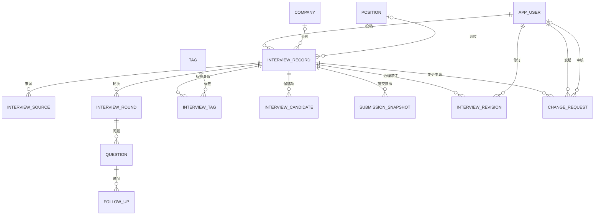

# 面个 Offer（Interview Vault）数据库设计

> **版本：V1 · Public Beta**
>
> **更新时间：2026-10-07**
>
> 本文件定义 V1 目标数据模型、关键约束、删除策略与索引原则。产品规则见 [PRD](../product/prd.md)，领域模型与状态流见 [系统架构](../architecture/system-architecture.md)，接口与并发约定见 [API 设计](../api/api-design.md)。

---

# 1. 设计原则

1. **按线上产品怎么用来设计，不为任何输入格式妥协。**
2. PostgreSQL 是 V1 唯一核心数据源。
3. 正式分类数据与用户候选值分离。
4. 已发布内容与待审核变更分离。
5. 生命周期依附的数据可以级联，共享实体不能跟随面经删除。
6. 能用状态机表达的业务状态，不再额外叠加 `isPublished / deleted` 等布尔字段。
7. 时间点字段统一使用 `xxx_time`，自然日字段使用 `xxx_date`。
8. Java 字段使用 camelCase，例如 `createTime`；数据库列使用 snake_case，例如 `create_time`。
9. 索引从真实查询反推，不因为字段“看起来重要”就全部加索引。

---

# 2. 表总览

V1 目标表：

```text
app_user
company
position_category
position
tag

interview_record
interview_source
interview_round
question
follow_up
interview_tag

interview_candidate
submission_snapshot
interview_revision
change_request
cheer
```

其中：

- `app_user / company / position / tag`：共享实体。
- `interview_record`：面经聚合根。
- `interview_round / question / follow_up`：面经内部组成部分。
- `interview_tag`：InterviewRecord 与 Tag 的多对多关系表。
- `interview_candidate`：待审核的新公司 / 岗位 / 标签候选值。
- `submission_snapshot`：投稿审计快照。
- `interview_revision`：管理员直接修改已发布内容时保存的修改前完整版本，用于治理审计。
- `change_request`：已发布内容修改 / 删除申请。
- `interview_source`：来源链接；新投稿 V1 UI 最多填写一个，表结构仍保留 1:N 以兼容历史数据中一份面经存在多个来源的情况。

---

# 3. ER 关系



说明：

- `interview_record.author_id` 允许为空：存量数据早于用户体系；站内新投稿必须归属作者。
- 待审核新公司 / 新岗位尚未创建正式实体时，`company_id / position_id` 可以暂时为空。
- 新用户投稿进入 `PUBLISHED` 前，必须满足发布约束；存量数据中的合法未知字段按原样保留，不为了满足新投稿规则伪造数据。

---

# 4. 核心枚举

数据库 V1 统一使用 `TEXT + CHECK`，不使用 PostgreSQL 原生 ENUM，避免以后增加值时迁移麻烦。

## 4.1 用户角色

```text
USER
ADMIN
```

## 4.2 招聘类型

```text
INTERN
CAMPUS
```

## 4.3 面经状态

```text
DRAFT
PENDING_REVIEW
PUBLISHED
REJECTED
REMOVED
```

## 4.4 轮次类型

新投稿：

```text
TECHNICAL
HR
```

存量数据兼容：

```text
UNKNOWN
```

`UNKNOWN` 只用于无法安全归一的历史轮次，不在新投稿 UI 中作为普通选项展示。

## 4.5 日期精度

```text
DAY
MONTH
YEAR
```

`interview_round.interview_date_precision` 使用该语义。V1 简化冻结后**新投稿没有精度概念**：日期要么是完整 YYYY-MM-DD（DAY），要么为空；MONTH / YEAR 只服务于存量数据的真实性，读取时兼容展示，更新时日期未变则原样保留。

## 4.6 岗位分类

方向**目录化**：方向存于 `position_category` 目录表（name / normalized_name / sort_order），管理员在治理时可新增方向，不受代码枚举限制。初始目录：

```text
Agent 开发 / AI 应用 / AI Infra / 后端开发 / 其他（兜底，sort 99）
```

`position.category_id` 外键指向目录表；新方向插入时排在「其他」之前。

## 4.7 候选项类型

```text
COMPANY
POSITION
TAG
```

## 4.8 变更申请

类型：

```text
UPDATE
DELETE
```

状态：

```text
PENDING
APPROVED
REJECTED
```

---

# 5. 目标 DDL

> 下面是 V1 目标逻辑 DDL。实际 Flyway 脚本落地前，还要结合现有代码和 API 查询再次核对；尤其是组合索引，不在没有真实 SQL 的情况下盲目定死。

## 5.1 用户

```sql
CREATE TABLE app_user (
    id            BIGINT GENERATED BY DEFAULT AS IDENTITY PRIMARY KEY,
    github_id     BIGINT NOT NULL UNIQUE,
    github_login  TEXT NOT NULL,
    avatar_url    TEXT,
    role          TEXT NOT NULL DEFAULT 'USER'
                  CHECK (role IN ('USER', 'ADMIN')),
    create_time   TIMESTAMPTZ NOT NULL DEFAULT now(),
    update_time   TIMESTAMPTZ NOT NULL DEFAULT now()
);
```

设计说明：

- `github_id` 是稳定外部身份，必须唯一。
- `github_login` 允许变化，只用于展示。
- V1 不保存密码。
- V1 不长期保存 GitHub Access Token。

---

## 5.2 公司

```sql
CREATE TABLE company (
    id               BIGINT GENERATED BY DEFAULT AS IDENTITY PRIMARY KEY,
    name             TEXT NOT NULL,
    normalized_name  TEXT NOT NULL UNIQUE,
    create_time      TIMESTAMPTZ NOT NULL DEFAULT now(),
    update_time      TIMESTAMPTZ NOT NULL DEFAULT now()
);
```

例如：

```text
name            = Redis（若这是 Tag）
normalizedName  = redis
```

名称规范化用于判断 `Redis / redis / REDIS` 等是否重复，展示名称仍保存标准写法。

---

## 5.3 岗位

岗位方向目录（管理员可扩展，基线迁移写入初始五类）：

```sql
CREATE TABLE position_category (
    id              BIGINT GENERATED BY DEFAULT AS IDENTITY PRIMARY KEY,
    name            TEXT NOT NULL,
    normalized_name TEXT NOT NULL UNIQUE,
    sort_order      INT  NOT NULL DEFAULT 0,
    create_time     TIMESTAMPTZ NOT NULL DEFAULT now()
);
```

```sql
CREATE TABLE position (
    id               BIGINT GENERATED BY DEFAULT AS IDENTITY PRIMARY KEY,
    name             TEXT NOT NULL,
    normalized_name  TEXT NOT NULL UNIQUE,
    category_id      BIGINT NOT NULL
                     REFERENCES position_category(id),
    create_time      TIMESTAMPTZ NOT NULL DEFAULT now(),
    update_time      TIMESTAMPTZ NOT NULL DEFAULT now()
);
```

`name` 是具体岗位，例如：

```text
Java 后端开发
Go 后端开发
Agent Infra Engineer
```

`category_id` 引用 `position_category` 行，决定首页筛选归属；新岗位创建时必选方向。

---

## 5.4 标签

```sql
CREATE TABLE tag (
    id               BIGINT GENERATED BY DEFAULT AS IDENTITY PRIMARY KEY,
    name             TEXT NOT NULL,
    normalized_name  TEXT NOT NULL UNIQUE,
    create_time      TIMESTAMPTZ NOT NULL DEFAULT now(),
    update_time      TIMESTAMPTZ NOT NULL DEFAULT now()
);
```

正式 Tag 表只存管理员确认后的标签。

用户新填的标签在审核前进入 `interview_candidate`，不能提前插入 `tag` 并标 PENDING。

---

## 5.5 面经

```sql
CREATE TABLE interview_record (
    id                      BIGINT GENERATED BY DEFAULT AS IDENTITY PRIMARY KEY,
    author_id               BIGINT REFERENCES app_user(id),
    company_id              BIGINT REFERENCES company(id),
    position_id             BIGINT REFERENCES position(id),
    department              TEXT,
    original_position_name  TEXT,
    inferred_position_name  TEXT,
    note                    TEXT,
    recruit_type            TEXT CHECK (recruit_type IN ('INTERN', 'CAMPUS')),
    status           TEXT NOT NULL DEFAULT 'DRAFT'
                     CHECK (status IN (
                         'DRAFT',
                         'PENDING_REVIEW',
                         'PUBLISHED',
                         'REJECTED',
                         'REMOVED'
                     )),
    version          BIGINT NOT NULL DEFAULT 0,
    rejection_reason TEXT,
    create_time      TIMESTAMPTZ NOT NULL DEFAULT now(),
    update_time      TIMESTAMPTZ NOT NULL DEFAULT now(),
    publish_time     TIMESTAMPTZ
);
```

为什么部分字段允许为空：

- 草稿可以尚未填写完整。
- 用户提出新公司 / 新岗位时，正式 ID 要等管理员审核。
- 历史数据可能存在“岗位未说明”。

因此，“发布时字段必须完整”主要由**业务发布校验**保证，而不是简单把所有列都设为 NOT NULL。

历史真实性字段说明：

- `department`：部门。新投稿可选填写（能确认时填，如“抖音电商”），是长期产品字段。
- `original_position_name`：原岗位原文，与归一后的 `position_id` 并存，不丢失用户原始记载。
- `inferred_position_name`：有依据的推断岗位，只做真实性存档。
- `note`：有事实含义的限定说明（时间依据、来源合并说明、岗位范围依据等）。它承担“这段数据为什么这样记录”的审计语义，不允许静默丢失。

`original_position_name / inferred_position_name / note` 是真实性辅助字段，新投稿 UI 不主动暴露，写入路径未携带时保留原值。

新用户投稿发布至少需要满足：

```text
status 从 PENDING_REVIEW -> PUBLISHED 前：
- company 已处理
- position 已处理
- recruitType 已填写
- 不存在未处理 Candidate
- 至少有一个有效 Round
- 每个正常 Round 的问题结构通过校验
```

数据允许合法缺失，不补造不存在的信息。

`version` 用于 API 乐观锁。作者编辑、管理员编辑、发布、拒绝或已发布版本被批准更新等成功写操作应递增。`rejection_reason` 保存当前一次审核拒绝原因；重新进入下一轮审核时清空，新的拒绝结果可以覆盖。

---

## 5.6 来源链接

```sql
CREATE TABLE interview_source (
    id               BIGINT GENERATED BY DEFAULT AS IDENTITY PRIMARY KEY,
    interview_id     BIGINT NOT NULL
                     REFERENCES interview_record(id) ON DELETE CASCADE,
    url              TEXT NOT NULL,
    normalized_url   TEXT NOT NULL,
    create_time      TIMESTAMPTZ NOT NULL DEFAULT now(),
    UNIQUE (interview_id, normalized_url)
);
```

规则：

- 新投稿页面 V1 最多填写一个来源链接。
- 历史记录允许一份面经保留多个来源。
- `normalized_url` 用于基础同源检测。
- **不能对 normalized_url 做全局 UNIQUE。**

原因：同一来源帖可能记录多个候选人 / 多段流程；URL 只能作为“可能重复”的线索，最终是否重复由管理员判断。

---

## 5.7 面试轮次

```sql
CREATE TABLE interview_round (
    id                      BIGINT GENERATED BY DEFAULT AS IDENTITY PRIMARY KEY,
    interview_id            BIGINT NOT NULL
                            REFERENCES interview_record(id) ON DELETE CASCADE,
    round_type              TEXT NOT NULL
                            CHECK (round_type IN ('TECHNICAL', 'HR', 'UNKNOWN')),
    round_no                INT,
    remark                  TEXT,
    interview_date          DATE,
    interview_date_precision TEXT
                            CHECK (interview_date_precision IN ('DAY', 'MONTH', 'YEAR')),
    sort_order              INT NOT NULL,
    create_time             TIMESTAMPTZ NOT NULL DEFAULT now(),
    update_time             TIMESTAMPTZ NOT NULL DEFAULT now(),

    UNIQUE (interview_id, sort_order),

    CONSTRAINT interview_round_type_no_ck CHECK (
        (round_type = 'TECHNICAL' AND round_no BETWEEN 1 AND 5)
        OR
        (round_type IN ('HR', 'UNKNOWN') AND round_no IS NULL)
    ),

    CONSTRAINT interview_round_date_ck CHECK (
        (interview_date IS NULL AND interview_date_precision IS NULL)
        OR
        (interview_date IS NOT NULL AND interview_date_precision IS NOT NULL)
    )
);
```

日期与精度同空同有：

```text
DAY     -> 完整确认日期，如 2026-06-15
MONTH   -> 只确认到月，存月首 2026-06-01，展示为 2026年6月
YEAR    -> 只确认到年，存年首 2026-01-01，展示为 2026年
NULL    -> 日期未知
```

新用户通过日期选择器提交的一般都是 `DAY`；`MONTH / YEAR` 主要服务历史数据真实性。

**发布时间不得冒充面试时间**：真实面试日未确认的轮次，`interview_date` 必须为 NULL，说明（如“真实面试时间未确认”）写入 `interview_record.note`。

含义：

```text
TECHNICAL + 1 -> 一面
TECHNICAL + 2 -> 二面
...
TECHNICAL + 5 -> 五面
HR             -> HR 面
```

特殊名称放 `remark`：

```text
TECHNICAL + 3 + remark="交叉面"
=> 三面 · 交叉面
```

`sort_order` 才是实际展示顺序，不能依赖 ID 或 create_time。

历史无法归一的轮次使用 `UNKNOWN + remark=原轮次描述`，避免为了结构统一而造假。

---

## 5.8 主问题

```sql
CREATE TABLE question (
    id                     BIGINT GENERATED BY DEFAULT AS IDENTITY PRIMARY KEY,
    round_id               BIGINT NOT NULL
                           REFERENCES interview_round(id) ON DELETE CASCADE,
    content                TEXT NOT NULL,
    sort_order             INT NOT NULL,

    -- V1 简化冻结：用户可见的唯一可选题目链接（LeetCode / 牛客 / Codeforces 等）
    reference_url          TEXT,

    -- 历史阅读能力兼容字段；新投稿不再写入，读取继续返回，保存时保持原值
    question_type          TEXT NOT NULL DEFAULT 'NORMAL'
                           CHECK (question_type IN ('NORMAL', 'ALGORITHM')),
    section_label          TEXT,
    context_note           TEXT,
    algorithm_title        TEXT,
    algorithm_description  TEXT,
    algorithm_requirements TEXT,
    leetcode_number        INT,
    leetcode_url           TEXT,

    create_time            TIMESTAMPTZ NOT NULL DEFAULT now(),
    update_time            TIMESTAMPTZ NOT NULL DEFAULT now(),

    UNIQUE (round_id, sort_order)
);
```

规则：

- Q1 / Q2 / Q3 不落库。
- UI 按 `sort_order` 生成 Q 编号。
- `id` 才是稳定问题标识和锚点。
- 读取时 `referenceUrl = reference_url ?? leetcode_url`，写入时带链接记 `ALGORITHM`，无链接新问题记 `NORMAL`。
- 历史兼容字段存在 ≠ 新投稿必须使用：新投稿不写入；更新时未被提交的字段保持原值，缺省不代表清空（唯一例外：「相关题目链接」被用户清空时同步清空 leetcode_url）。

---

## 5.9 追问

```sql
CREATE TABLE follow_up (
    id            BIGINT GENERATED BY DEFAULT AS IDENTITY PRIMARY KEY,
    question_id   BIGINT NOT NULL
                  REFERENCES question(id) ON DELETE CASCADE,
    content       TEXT NOT NULL,
    sort_order    INT NOT NULL,
    create_time   TIMESTAMPTZ NOT NULL DEFAULT now(),
    update_time   TIMESTAMPTZ NOT NULL DEFAULT now(),

    UNIQUE (question_id, sort_order)
);
```

追问依附于主问题，不独立存在。

---

## 5.10 面经标签中间表

```sql
CREATE TABLE interview_tag (
    interview_id  BIGINT NOT NULL
                  REFERENCES interview_record(id) ON DELETE CASCADE,
    tag_id        BIGINT NOT NULL
                  REFERENCES tag(id),
    PRIMARY KEY (interview_id, tag_id)
);
```

联合主键天然保证：

> 同一篇面经不能重复绑定同一个 Tag。

为了支持从 Tag 反查面经，需要：

```sql
CREATE INDEX interview_tag_tag_idx
ON interview_tag(tag_id);
```

---

## 5.11 候选值

```sql
CREATE TABLE interview_candidate (
    id                BIGINT GENERATED BY DEFAULT AS IDENTITY PRIMARY KEY,
    interview_id      BIGINT NOT NULL
                      REFERENCES interview_record(id) ON DELETE CASCADE,
    type              TEXT NOT NULL
                      CHECK (type IN ('COMPANY', 'POSITION', 'TAG')),
    value             TEXT NOT NULL,
    normalized_value  TEXT NOT NULL,
    sort_order        INT NOT NULL DEFAULT 0,
    create_time       TIMESTAMPTZ NOT NULL DEFAULT now()
);
```

一份面经同一时间最多只能有一个候选 Company 和一个候选 Position：

```sql
CREATE UNIQUE INDEX interview_candidate_company_uk
ON interview_candidate(interview_id)
WHERE type = 'COMPANY';

CREATE UNIQUE INDEX interview_candidate_position_uk
ON interview_candidate(interview_id)
WHERE type = 'POSITION';
```

Tag 候选允许多个。

管理员处理 Candidate 后：

- 选择已有正式实体，或
- 创建新的正式实体，或
- 删除不合理 Tag 候选，

然后移除当前 Candidate。

原始值仍可从 SubmissionSnapshot 追溯。

---

## 5.12 投稿快照

```sql
CREATE TABLE submission_snapshot (
    id            BIGINT GENERATED BY DEFAULT AS IDENTITY PRIMARY KEY,
    interview_id  BIGINT NOT NULL REFERENCES interview_record(id),
    payload       JSONB NOT NULL,
    create_time   TIMESTAMPTZ NOT NULL DEFAULT now()
);
```

设计理由：

- 快照只用于审计与追溯。
- 不参与公开查询和搜索。
- 不复制出 SubmissionRound / SubmissionQuestion / SubmissionFollowUp 第二套业务表。
- 管理员后续如何改正式内容，都不会改变已经落下来的历史快照。

---

## 5.13 修改 / 删除申请

```sql
CREATE TABLE change_request (
    id            BIGINT GENERATED BY DEFAULT AS IDENTITY PRIMARY KEY,
    interview_id  BIGINT NOT NULL REFERENCES interview_record(id),
    requester_id  BIGINT NOT NULL REFERENCES app_user(id),
    reviewer_id   BIGINT REFERENCES app_user(id),

    type          TEXT NOT NULL
                  CHECK (type IN ('UPDATE', 'DELETE')),
    status        TEXT NOT NULL DEFAULT 'PENDING'
                  CHECK (status IN ('PENDING', 'APPROVED', 'REJECTED')),

    base_version  BIGINT NOT NULL,
    request_version BIGINT NOT NULL DEFAULT 0 CHECK (request_version >= 0),
    payload       JSONB,
    reason        TEXT,

    create_time   TIMESTAMPTZ NOT NULL DEFAULT now(),
    update_time   TIMESTAMPTZ NOT NULL DEFAULT now(),
    review_time   TIMESTAMPTZ,

    CONSTRAINT change_request_payload_ck CHECK (
        type <> 'UPDATE' OR payload IS NOT NULL
    )
);
```

同一份面经同一时间最多一个待处理申请：

```sql
CREATE UNIQUE INDEX change_request_one_pending_uk
ON change_request(interview_id)
WHERE status = 'PENDING';
```

因此：

- 第一次申请修改：INSERT PENDING UPDATE。
- 再次编辑：UPDATE 同一条 PENDING 记录的 payload。
- 改为删除：UPDATE 同一条 PENDING 记录为 DELETE，并清理 UPDATE payload。
- 管理员审批后变成 APPROVED / REJECTED。
- 下一次新的变更申请再创建新记录。

`base_version` 保存申请创建 / 覆盖保存时所基于的正式 `interview_record.version`：

- 创建或覆盖 PENDING 申请时，`baseVersion` 必须等于当前正式 version，否则返回版本冲突；
- 管理员批准 UPDATE 时再次校验 `base_version` 与当前正式 version 一致，不一致返回 `CHANGE_REQUEST_CONFLICT`；
- 有了“存在 PENDING 申请时禁止管理员直接修改正式内容”的规则（见 5.14 / 6.1），正式 version 在申请待审期间不会变化。创建 / 覆盖申请与管理员直接修改正式内容都在短事务内对目标 interview_record 加行级锁后再检查 version 与 PENDING 申请，避免 check-then-act 竞态；`base_version` 仍作为审批时的最终一致性校验。

审核期间 `interview_record.status` 仍为 `PUBLISHED`。

---

## 5.14 治理修订审计

```sql
CREATE TABLE interview_revision (
    id            BIGINT GENERATED BY DEFAULT AS IDENTITY PRIMARY KEY,
    interview_id  BIGINT NOT NULL REFERENCES interview_record(id),
    editor_id     BIGINT NOT NULL REFERENCES app_user(id),
    base_version  BIGINT NOT NULL,
    payload       JSONB NOT NULL,
    create_time   TIMESTAMPTZ NOT NULL DEFAULT now()
);
```

用途：

- 管理员直接修改已发布面经时，在同一事务内先保存**修改前的完整正式版本**；
- `payload` 是修改前内容，不是修改后内容；修改后内容就是 `interview_record` 本身；
- `base_version` 是管理员编辑所基于的正式 version；
- 属于治理审计数据，不参与公开查询与搜索，不因普通内容编辑被清理。

它不与 `submission_snapshot` 混用：Snapshot 语义固定为“用户提交审核时的原始快照”，Revision 语义固定为“管理员修改正式内容前的旧版本”。

---

## 5.15 页尾祝福

```sql
CREATE TABLE cheer (
    id            BIGINT GENERATED BY DEFAULT AS IDENTITY PRIMARY KEY,
    user_id       BIGINT REFERENCES app_user(id),
    create_time   TIMESTAMPTZ NOT NULL DEFAULT now()
);

CREATE UNIQUE INDEX cheer_user_uk ON cheer (user_id) WHERE user_id IS NOT NULL;
```

用途：

- 列表页尾「接受祝福」轻互动，每次点击一行；
- 登录用户一人一次由部分唯一索引兜底（重复 POST 幂等返回当前总数）；游客由前端 localStorage 防重复，服务端按 IP 限流；
- 彩蛋级数据，不做匿名指纹，不参与搜索与审核。

---

# 6. 状态约束

## 6.1 面经状态

```text
DRAFT
  -> 提交审核
  -> PENDING_REVIEW
      -> 发布
      -> PUBLISHED
      -> 拒绝
      -> REJECTED

PENDING_REVIEW
  -> 作者编辑保存
  -> 仍为 PENDING_REVIEW（内容与 version 更新）

REJECTED
  -> 作者编辑保存
  -> DRAFT（清空 rejection_reason）
  -> 再次提交审核
  -> PENDING_REVIEW

PUBLISHED
  -> 删除申请批准
  -> REMOVED

REMOVED
  -> 作者编辑保存
  -> DRAFT（复活，清空下架原因相关状态）
  -> 再次提交审核
  -> PENDING_REVIEW

PUBLISHED
  -> 管理员直接修改
  -> 仍为 PUBLISHED（version + 1，写 interview_revision）
```

状态迁移规则：

- **提交审核只从 DRAFT 发起**；REJECTED 投稿必须先经作者编辑保存回到 DRAFT，再重新提交。
- 作者编辑保存 PENDING_REVIEW 投稿不改变状态，审核端始终看到最新版本。
- **管理员直接修改仅限 PUBLISHED**，且当前不存在 PENDING ChangeRequest；违反则拒绝写入。

不能把“已发布内容正在修改审核”表示成：

```text
PUBLISHED -> PENDING_REVIEW
```

因为这会让正式线上版本失去“已发布”语义。

正确方式是：

```text
InterviewRecord = PUBLISHED
+
ChangeRequest = PENDING
```

---

## 6.2 发布校验

新用户投稿进入 PUBLISHED 前，Service 必须检查：

- 当前状态为 PENDING_REVIEW；
- Company 已确定；
- Position 已确定；
- RecruitType 已确定；
- 不存在 Candidate；
- Round / Question 结构合法；
- 管理员身份合法。

数据库负责基础约束，Service 负责跨表业务约束。

---

# 7. 名称规范化

`company / position / tag` 使用：

```text
name
normalized_name
```

V1 基础规范化至少包括：

1. trim 首尾空白；
2. 连续空白归一；
3. 英文统一大小写比较；
4. 中文保持原文本语义。

例如：

```text
Redis
redis
REDIS
```

最终都得到同一比较值：

```text
redis
```

展示时仍使用管理员确定的标准 `name`。

业务层先友好提示“该项已存在”，数据库 UNIQUE 做并发场景最终兜底。

---

# 8. 来源 URL 去重

V1 去重针对的是：

> 同一份面经被重复投稿。

不是：

> 不同公司问了相似问题。

因此：

- 不比较问题语义来自动判重；
- 不用 Embedding；
- 不用 AI 判重；
- 不因为“Redis 分布式锁怎么实现”相似就认定两篇面经重复。

来源 URL 只做基础同源提醒。

`normalized_url` 可以做：

- 去首尾空白；
- 统一明显无意义的尾部斜杠；
- 去除明确的跟踪参数。

但不能因为规范化后 URL 一样就自动合并正式记录。

管理员拥有最终判断权。

---

# 9. 删除策略

## 9.1 可以级联的数据

生命周期依附 InterviewRecord：

```text
interview_source
interview_round
question
follow_up
interview_tag
interview_candidate
```

**纯草稿物理删除的条件**：

```text
status = DRAFT
AND 从未创建过 submission_snapshot（即从未提交过审核）
```

一旦进入过平台审核历史（提交过、被拒绝过），记录不可物理抹除，审计链必须保留；被拒投稿由作者继续编辑或留存，不提供物理删除。

## 9.2 不能跟随面经删除的数据

共享实体：

```text
app_user
company
position
tag
```

不能因为删除一份面经而级联删除。

## 9.3 已发布面经

已发布内容不直接物理删除。

删除申请批准后：

```text
PUBLISHED -> REMOVED
```

稳定 Interview ID 继续保留，页面可以显示“该面经已下架”。

## 9.4 审计数据

```text
submission_snapshot
interview_revision
change_request
```

属于审计数据，不因为普通内容修改而删除。

---

# 10. 索引原则

## 10.1 已经确定需要的索引

### 唯一约束天然产生的索引

- `app_user.github_id`
- `company.normalized_name`
- `position.normalized_name`
- `tag.normalized_name`
- `interview_tag(interview_id, tag_id)`
- `interview_round(interview_id, sort_order)`
- `question(round_id, sort_order)`
- `follow_up(question_id, sort_order)`
- Candidate 的 Company / Position 部分唯一索引
- ChangeRequest 的单 PENDING 部分唯一索引

### 明确的反向查询索引

```sql
CREATE INDEX interview_record_author_idx
ON interview_record(author_id);

CREATE INDEX interview_record_company_idx
ON interview_record(company_id);

CREATE INDEX interview_record_position_idx
ON interview_record(position_id);

CREATE INDEX interview_source_normalized_url_idx
ON interview_source(normalized_url);

CREATE INDEX interview_tag_tag_idx
ON interview_tag(tag_id);

CREATE INDEX interview_candidate_interview_idx
ON interview_candidate(interview_id, type, sort_order);

CREATE INDEX submission_snapshot_interview_idx
ON submission_snapshot(interview_id, create_time DESC);

CREATE INDEX interview_revision_interview_idx
ON interview_revision(interview_id, create_time DESC);

CREATE INDEX change_request_interview_idx
ON change_request(interview_id, status, create_time DESC);
```

说明：

- PostgreSQL 不会因为一个列是外键就自动给引用列创建查询索引。
- 已有联合 UNIQUE 的前缀能满足部分父子查询时，不再重复创建等价单列索引。

---

## 10.2 暂不拍死的索引

以下字段很重要，但**现在先作为索引候选，不机械地一个字段一个索引**：

- `interview_record.status`
- `interview_record.recruit_type`
- Company + Status
- Position + Status
- RecruitType + Status
- 面试日期排序
- 搜索文本

原因：

实际高频查询可能是：

```sql
WHERE status = 'PUBLISHED'
  AND company_id = ?
  AND recruit_type = ?
ORDER BY ...
```

这类查询最终更可能需要联合索引，而不是：

```text
INDEX(status)
INDEX(company_id)
INDEX(recruit_type)
```

全部孤立存在。

所以最终组合索引在 **API / Search SQL 设计完成后**，结合真实 SQL、数据量和 `EXPLAIN` 决定。

---

## 10.3 为什么索引不是越多越好

索引会增加：

- INSERT 成本；
- UPDATE 成本；
- DELETE 成本；
- 磁盘占用；
- VACUUM / 维护成本。

V1 产品读取远多于投稿写入，可以适当偏向读性能，但依然不应给所有字段无脑建索引。

判断一个字段是否值得索引，优先问：

1. 是否高频出现在 WHERE？
2. 是否高频出现在 JOIN？
3. 是否高频用于 ORDER BY？
4. 是否需要 UNIQUE？
5. 查询是否足够频繁、数据量是否足够大？

---

# 11. 搜索查询

V1 搜索仍直接使用 PostgreSQL。

逻辑示意：

```sql
SELECT DISTINCT i.id
FROM interview_record i
LEFT JOIN company c ON c.id = i.company_id
LEFT JOIN position p ON p.id = i.position_id
LEFT JOIN position_category pc ON pc.id = p.category_id
WHERE i.status = 'PUBLISHED'
  AND (:companyId IS NULL OR i.company_id = :companyId)
  AND (:positionCategory IS NULL OR pc.id = :positionCategory)
  AND (:recruitType IS NULL OR i.recruit_type = :recruitType)
  AND (:kw1 IS NULL OR <整篇面经任意允许字段命中 kw1>)
  AND (:kw2 IS NULL OR <整篇面经任意允许字段命中 kw2>);
```

每个关键词独立使用 EXISTS 表达“整篇至少命中一次”，因此：

```text
Redis 分布式锁
```

可以：

- Redis 命中 Q1；
- 分布式锁命中 Q5；

整篇仍然算命中。

问题片段必须来自真实命中 Question / FollowUp，不能把两个不同问题包装成一题。

V1 当前不预建全文检索派生表。

如果真实用户增长后 `ILIKE / EXISTS` 查询计划明显恶化，优先评估 PostgreSQL 自身方案，例如 pg_trgm，再决定是否需要 Elasticsearch。

---

# 12. 面试时间与排序

面试日期属于 `interview_round.interview_date`。

InterviewRecord 不额外维护一个需要人工同步的：

```text
interview_date
```

列表卡片需要的首轮日期通过轮次计算：

```text
MIN(interview_round.interview_date)
```

忽略无法确认日期的轮次。精度为 MONTH / YEAR 的轮次按已知部分（月首 / 年首）参与计算，展示时按精度渲染为「2026年6月」「2026年」。

这样避免出现：

```text
一面日期改了
但 interview_record.interview_date 忘了同步
```

造成双份事实不一致。

如果未来数据量证明这个聚合成为热点，再考虑由数据库生成列、物化视图或受控冗余优化；V1 不提前做。

---


# 13. 事务边界

以下操作必须事务化：

## 13.1 提交审核

```text
更新 InterviewRecord
+ 保存 Candidate
+ 创建 SubmissionSnapshot
+ 状态进入 PENDING_REVIEW
```

要么全部成功，要么全部回滚。

## 13.2 Candidate 处理

```text
校验 Candidate 仍存在
+ 校验 InterviewRecord.status = PENDING_REVIEW
+ 校验请求 version
+ 创建 / 复用正式 Catalog 或绑定已有项
+ 移除 Candidate
+ InterviewRecord.version + 1
```

Candidate resolve 也是面经审核内容变更，必须递增 version，避免作者或其他管理员基于旧页面继续写入。

## 13.3 管理员发布

```text
处理 Candidate
+ 必要时创建 Company / Position / Tag
+ 更新正式关联
+ 修改正文
+ 状态 PENDING_REVIEW -> PUBLISHED
+ publish_time
```

必须处于同一业务事务。

## 13.4 批准修改

```text
校验 ChangeRequest=PENDING 与 expectedRequestVersion
+ 保存修改前的完整正式版本到 interview_revision
+ 应用 payload
+ 标记 APPROVED
+ review_time / reviewer_id
```

线上旧版本只在事务成功提交后被替换。

## 13.5 批准删除

```text
ChangeRequest PENDING DELETE
+ InterviewRecord PUBLISHED -> REMOVED
+ ChangeRequest -> APPROVED
```

## 13.6 管理员直接修改已发布内容

```text
校验当前无 PENDING ChangeRequest
+ 保存 interview_revision（修改前的完整正式版本）
+ 条件更新正式内容（WHERE status = 'PUBLISHED' AND version = ?）
+ version + 1，仍为 PUBLISHED
```

任一步失败整体回滚；affectedRows = 0 时返回版本或状态冲突，不产生 revision 脏数据。

---

# 14. 并发与最终约束

数据库唯一约束负责最终兜底，例如：

- 同一 githubId 只能有一个 User；
- normalizedName 不能重复；
- 同一 Interview + Tag 不能重复关联；
- 同一 Interview 同时只能有一个 PENDING ChangeRequest。

业务层负责：

- 给用户友好的错误提示；
- 判断 Candidate 是否已经存在相同正式项；
- 发布前跨表校验；
- 管理员审核时的版本冲突检测。

“管理员打开旧审核页、作者随后修改投稿”的并发策略已确定为 `interview_record.version` 乐观锁。客户端写请求携带读取时的 version，SQL 使用 `WHERE id = ? AND version = ?`（状态迁移再附带预期 status）并检查 affectedRows。Candidate resolve 同样携带 version，成功后 version + 1。affectedRows=0 表示状态或版本已变化，返回 409；UNIQUE 约束继续负责重复数据的最终兜底。

对 ChangeRequest 创建 / 覆盖 / 审批以及管理员直接修改 PUBLISHED 这组需要同时判断“正式 version + 是否存在 PENDING 申请”的操作，事务内先 `SELECT ... FOR UPDATE` 锁定目标 interview_record，再完成检查与写入，保证两类治理操作线性化。该锁只存在于一次短事务内。

---

# 15. V1 不做的数据库能力

V1 不建设：

- Redis 缓存一致性体系；
- Elasticsearch 索引同步；
- MQ 异步审核流水线；
- 向量数据库；
- Embedding 相似度去重；
- 复杂事件溯源；
- Submission / Interview 两套完整镜像表；
- 长期 Alias / Mapping 表；
- Offer / 挂 / 泡池等结果状态表。

后续演进必须由真实业务需求、数据规模或性能指标驱动。

## 申请修订号

change_request.request_version 在 V1 建表时即存在，默认 0。每次覆盖申请递增；审批必须携带读取时的 expectedRequestVersion。正式面经 base_version 与申请 request_version 分别校验，旧审批页不能处理被覆盖后的申请。
